### Escuela Colombiana de Ingeniería
### Arquitecturas de Software - ARSW
### Santiago Carmona - Jacobo Diaz
## Escalamiento en Azure con Maquinas Virtuales, Sacale Sets y Service Plans

### Dependencias
* Cree una cuenta gratuita dentro de Azure. Para hacerlo puede guiarse de esta [documentación](https://azure.microsoft.com/es-es/free/students/). Al hacerlo usted contará con $100 USD para gastar durante 12 meses.

### Parte 0 - Entendiendo el escenario de calidad

Adjunto a este laboratorio usted podrá encontrar una aplicación totalmente desarrollada que tiene como objetivo calcular el enésimo valor de la secuencia de Fibonnaci.

**Escalabilidad**
Cuando un conjunto de usuarios consulta un enésimo número (superior a 1000000) de la secuencia de Fibonacci de forma concurrente y el sistema se encuentra bajo condiciones normales de operación, todas las peticiones deben ser respondidas y el consumo de CPU del sistema no puede superar el 70%.

### Parte 1 - Escalabilidad vertical

1. Diríjase a el [Portal de Azure](https://portal.azure.com/) y a continuación cree una maquina virtual con las características básicas descritas en la imágen 1 y que corresponden a las siguientes:
    * Resource Group = SCALABILITY_LAB
    * Virtual machine name = VERTICAL-SCALABILITY
    * Image = Ubuntu Server 
    * Size = Standard B1ls
    * Username = scalability_lab
    * SSH publi key = Su llave ssh publica


### Evidencia


2. Para conectarse a la VM use el siguiente comando, donde las `x` las debe remplazar por la IP de su propia VM (Revise la sección "Connect" de la virtual machine creada para tener una guía más detallada).

    `ssh scalability_lab@xxx.xxx.xxx.xxx`

    ### Evidencia
    Antes de conectarmos, tuvimos que descargar la clave .pem y darle permisos de ejecución.
    

3. Instale node, para ello siga la sección *Installing Node.js and npm using NVM* que encontrará en este [enlace](https://linuxize.com/post/how-to-install-node-js-on-ubuntu-18.04/).

   ### Evidencia

   


4. Para instalar la aplicación adjunta al Laboratorio, suba la carpeta `FibonacciApp` a un repositorio al cual tenga acceso y ejecute estos comandos dentro de la VM:

    `git clone <your_repo>`

    `cd <your_repo>/FibonacciApp`

    `npm install`

5. Para ejecutar la aplicación puede usar el comando `npm FibinacciApp.js`, sin embargo una vez pierda la conexión ssh la aplicación dejará de funcionar. Para evitar ese compartamiento usaremos *forever*. Ejecute los siguientes comando dentro de la VM.

    ` node FibonacciApp.js`

   ### Evidencia
   

6. Antes de verificar si el endpoint funciona, en Azure vaya a la sección de *Networking* y cree una *Inbound port rule* tal como se muestra en la imágen. Para verificar que la aplicación funciona, use un browser y user el endpoint `http://xxx.xxx.xxx.xxx:3000/fibonacci/6`. La respuesta debe ser `The answer is 8`.


### Evidencia


7. La función que calcula en enésimo número de la secuencia de Fibonacci está muy mal construido y consume bastante CPU para obtener la respuesta. Usando la consola del Browser documente los tiempos de respuesta para dicho endpoint usando los siguintes valores:
    * 1000000
    * 1010000
    * 1020000
    * 1030000
    * 1040000
    * 1050000
    * 1060000
    * 1070000
    * 1080000
    * 1090000    

    ### Evidencia
    

8. Dírijase ahora a Azure y verifique el consumo de CPU para la VM. (Los resultados pueden tardar 5 minutos en aparecer).


  ### Evidencia
  


9. Ahora usaremos Postman para simular una carga concurrente a nuestro sistema. Siga estos pasos.
    * Instale newman con el comando `npm install newman -g`. Para conocer más de Newman consulte el siguiente [enlace](https://learning.getpostman.com/docs/postman/collection-runs/command-line-integration-with-newman/).
    * Diríjase hasta la ruta `FibonacciApp/postman` en una maquina diferente a la VM.
    * Para el archivo `[ARSW_LOAD-BALANCING_AZURE].postman_environment.json` cambie el valor del parámetro `VM1` para que coincida con la IP de su VM.
    * Ejecute el siguiente comando.

    ```
    newman run ARSW_LOAD-BALANCING_AZURE.postman_collection.json -e [ARSW_LOAD-BALANCING_AZURE].postman_environment.json -n 10 &
    newman run ARSW_LOAD-BALANCING_AZURE.postman_collection.json -e [ARSW_LOAD-BALANCING_AZURE].postman_environment.json -n 10
    ```

10. La cantidad de CPU consumida es bastante grande y un conjunto considerable de peticiones concurrentes pueden hacer fallar nuestro servicio. Para solucionarlo usaremos una estrategia de Escalamiento Vertical. En Azure diríjase a la sección *size* y a continuación seleccione el tamaño `B2ms`.


11. Una vez el cambio se vea reflejado, repita el paso 7, 8 y 9.
   ### Evidencia
   
   
   

12. Evalue el escenario de calidad asociado al requerimiento no funcional de escalabilidad y concluya si usando este modelo de escalabilidad logramos cumplirlo.

  #### Respuesta
  Si porque al redefinir el tamaño, aumentamos la capacidad de procesamiento de la máquina virtual. Esto se puede evidenciar en las capturas anteriores, donde los tiempos de respuesta fueron menores y el consumo de CPU también disminuyó.

13. Vuelva a dejar la VM en el tamaño inicial para evitar cobros adicionales.

**Preguntas**

1. ¿Cuántos y cuáles recursos crea Azure junto con la VM?


2. ¿Brevemente describa para qué sirve cada recurso?

    NIC: Conecta la VM a la red

    VNet: Red virtual privada donde vive la VM

    Subnet: Segmento dentro de la VNet

    Public IP: Dirección IP pública para acceder desde internet (la que usas en el SSH)

    NSG: Firewall que controla el tráfico entrante/saliente (aquí defines las reglas de puertos)

    OS Disk: Disco duro virtual donde está el sistema operativo

3. ¿Al cerrar la conexión ssh con la VM, por qué se cae la aplicación que ejecutamos con el comando `npm FibonacciApp.js`? ¿Por qué debemos crear un *Inbound port rule* antes de acceder al servicio?

    Porque npm FibonacciApp.js corre como proceso hijo de la sesión SSH. Al cerrar la conexión, el proceso padre muere y arrastra todos sus hijos. Por eso se usa forever, que corre la app como proceso independiente del sistema.

    El Inbound port rule es necesario porque el NSG bloquea todo el tráfico por defecto. Sin una regla que abra el puerto 3000, Azure descarta los paquetes antes de que lleguen a la VM.
   

4. Adjunte tabla de tiempos e interprete por qué la función tarda tando tiempo.
 

    Cada petición tarda en promedio 20 segundos, lo cual se explica por dos razones principales. Primero, la VM B1ls tiene recursos extremadamente limitados (1 vCPU y 0.5 GiB de RAM), lo que restringe severamente la capacidad de procesamiento. Segundo, y más importante, el algoritmo de Fibonacci implementado usa recursión simple, que tiene una complejidad exponencial O(2^n). Esto significa que para calcular el enésimo número, la función se llama a sí misma millones de veces recalculando los mismos valores repetidamente sin guardar resultados intermedios, lo que hace el proceso extremadamente ineficiente para valores grandes.


5. Adjunte imágen del consumo de CPU de la VM e interprete por qué la función consume esa cantidad de CPU.
  

    El consumo de CPU cercano al 50% se explica por la misma razón: el algoritmo recursivo sin memoización obliga al procesador a realizar una cantidad masiva de operaciones repetidas para cada petición. Al ser una VM con una sola vCPU, prácticamente la mitad de toda su capacidad de cómputo queda comprometida atendiendo una única solicitud. Si llegaran varias peticiones concurrentes, el consumo fácilmente superaría el 70% establecido como límite en el criterio de escalabilidad del laboratorio, lo que confirma que tanto el tamaño de la VM como la implementación del algoritmo son factores críticos del problema.


6. Adjunte la imagen del resumen de la ejecución de Postman. Interprete:
    * Tiempos de ejecución de cada petición.
    * Si hubo fallos documentelos y explique.

        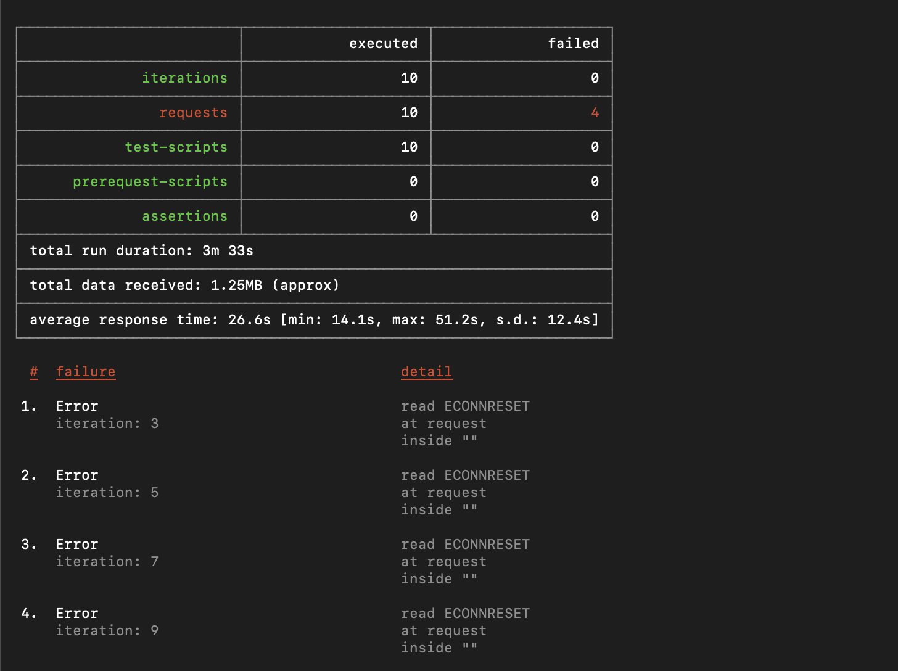


        Tiempos de ejecución:
        Se ejecutaron 10 iteraciones con un tiempo total de 3 minutos y 33 segundos. El tiempo de respuesta promedio fue de 26.6 segundos por petición, con un mínimo de 14.1 segundos y un máximo de 51.2 segundos. Esta alta variación (desviación estándar de 12.4s) indica que la VM B1ls era inconsistente bajo carga concurrente, ya que mientras procesaba una petición pesada de Fibonacci, las siguientes debían esperar más tiempo para ser atendidas.
        Fallos:
        Se presentaron 4 fallos de tipo ECONNRESET en las iteraciones 3, 5, 7 y 9, es decir el 40% de las peticiones fallaron. El error ECONNRESET significa que el servidor cerró la conexión abruptamente antes de enviar una respuesta. Esto ocurrió porque la VM B1ls con apenas 1 vCPU y 0.5 GiB de RAM se saturó completamente al recibir peticiones concurrentes del cálculo recursivo de Fibonacci. Al no poder mantener todas las conexiones abiertas simultáneamente, el sistema simplemente las terminó forzosamente, evidenciando que esta infraestructura no cumple con el criterio de escalabilidad establecido que exige responder todas las peticiones con un consumo de CPU menor al 70%.


7. ¿Cuál es la diferencia entre los tamaños `B2ms` y `B1ls` (no solo busque especificaciones de infraestructura)?

    El tamaño B1ls cuenta con 1 vCPU y apenas 0.5 GiB de RAM, mientras que el B2ms tiene 2 vCPUs y 8 GiB de RAM. Más allá de las especificaciones, ambos pertenecen a la serie B de Azure, que son máquinas de tipo "burstable", es decir, acumulan créditos de CPU cuando están en reposo y los gastan cuando necesitan mayor rendimiento. 
    
    Sin embargo, el B1ls acumula solo 6 créditos por hora, lo que lo hace adecuado únicamente para cargas mínimas y esporádicas como pruebas o aplicaciones muy livianas. El B2ms en cambio acumula 24 créditos por hora y tiene mucha más memoria, por lo que puede sostener cargas de trabajo moderadas por periodos más largos sin degradarse. En el contexto de este laboratorio, el B1ls claramente se queda sin recursos al recibir peticiones concurrentes pesadas como el cálculo de Fibonacci, mientras que el B2ms ofrece un margen significativamente mayor para manejar esa carga.

8. ¿Aumentar el tamaño de la VM es una buena solución en este escenario?, ¿Qué pasa con la FibonacciApp cuando cambiamos el tamaño de la VM?

    No es la mejor solución a largo plazo. Es escalabilidad vertical, que tiene un límite físico y un costo creciente. La FibonacciApp cuando cambia el tamaño de VM se reinicia, causando downtime.


9. ¿Qué pasa con la infraestructura cuando cambia el tamaño de la VM? ¿Qué efectos negativos implica?
    - La VM se reinicia (downtime)
    - La app deja de responder durante el cambio
    - Si no se usa forever o similar, hay que volver a iniciar la app manualmente


10. ¿Hubo mejora en el consumo de CPU o en los tiempos de respuesta? Si/No ¿Por qué?

    #### Antes del escalamiento

    Sí hubo mejora. Al escalar verticalmente de B1ls a B2ms se evidencia una reducción notable en los tiempos de respuesta, lo cual se explica directamente por las mejores capacidades del B2ms. Esto permite que el procesador atienda las peticiones más rápido ya que tiene más recursos disponibles para ejecutar el algoritmo. Sin embargo, es importante aclarar que la mejora se debe exclusivamente al aumento del hardware y no a una optimización del algoritmo, por lo que con cargas suficientemente grandes o con muchas peticiones concurrentes, el sistema seguirá presentando limitaciones, simplemente tardará más en llegar a ese punto de saturación.


11. Aumente la cantidad de ejecuciones paralelas del comando de postman a `4`. ¿El comportamiento del sistema es porcentualmente mejor?

### Parte 2 - Escalabilidad horizontal

#### Crear el Balanceador de Carga

Antes de continuar puede eliminar el grupo de recursos anterior para evitar gastos adicionales y realizar la actividad en un grupo de recursos totalmente limpio.

1. El Balanceador de Carga es un recurso fundamental para habilitar la escalabilidad horizontal de nuestro sistema, por eso en este paso cree un balanceador de carga dentro de Azure tal cual como se muestra en la imágen adjunta.


### Evidencia
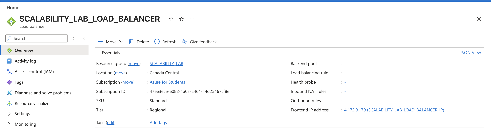

2. A continuación cree un *Backend Pool*, guiese con la siguiente imágen.


### Evidencia
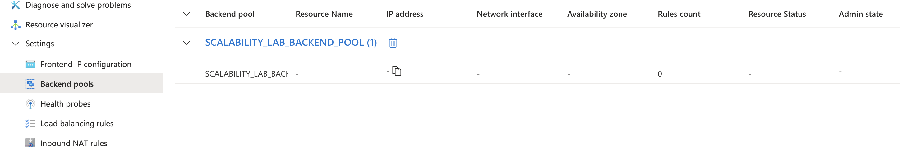

3. A continuación cree un *Health Probe*, guiese con la siguiente imágen.


### Evidencia
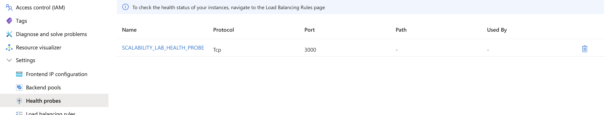

4. A continuación cree un *Load Balancing Rule*, guiese con la siguiente imágen.


### Evidencia
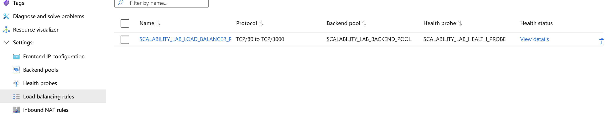

5. Cree una *Virtual Network* dentro del grupo de recursos, guiese con la siguiente imágen.


### Evidencia
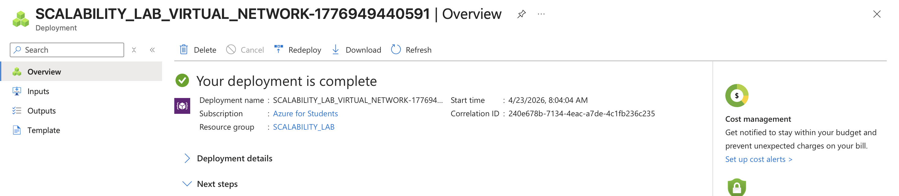

#### Crear las maquinas virtuales (Nodos)

Ahora vamos a crear 3 VMs (VM1, VM2 y VM3) con direcciones IP públicas standar en 3 diferentes zonas de disponibilidad. Después las agregaremos al balanceador de carga.

1. En la configuración básica de la VM guíese por la siguiente imágen. Es importante que se fije en la "Avaiability Zone", donde la VM1 será 1, la VM2 será 2 y la VM3 será 3.


2. En la configuración de networking, verifique que se ha seleccionado la *Virtual Network*  y la *Subnet* creadas anteriormente. Adicionalmente asigne una IP pública y no olvide habilitar la redundancia de zona.


3. Para el Network Security Group seleccione "avanzado" y realice la siguiente configuración. No olvide crear un *Inbound Rule*, en el cual habilite el tráfico por el puerto 3000. Cuando cree la VM2 y la VM3, no necesita volver a crear el *Network Security Group*, sino que puede seleccionar el anteriormente creado.


4. Ahora asignaremos esta VM a nuestro balanceador de carga, para ello siga la configuración de la siguiente imágen.


5. Finalmente debemos instalar la aplicación de Fibonacci en la VM. para ello puede ejecutar el conjunto de los siguientes comandos, cambiando el nombre de la VM por el correcto

```
git clone https://github.com/daprieto1/ARSW_LOAD-BALANCING_AZURE.git

curl -o- https://raw.githubusercontent.com/creationix/nvm/v0.34.0/install.sh | bash
source /home/vm1/.bashrc
nvm install node

cd ARSW_LOAD-BALANCING_AZURE/FibonacciApp
npm install

npm install forever -g
forever start FibonacciApp.js
```

Realice este proceso para las 3 VMs, por ahora lo haremos a mano una por una, sin embargo es importante que usted sepa que existen herramientas para aumatizar este proceso, entre ellas encontramos Azure Resource Manager, OsDisk Images, Terraform con Vagrant y Paker, Puppet, Ansible entre otras.

### Evidencia
#### IMPORTANTE!
Solo se usaron 2 máquinas virtuales debido a que la licencia de estudiante no nos permitió crear la tercera máquina.
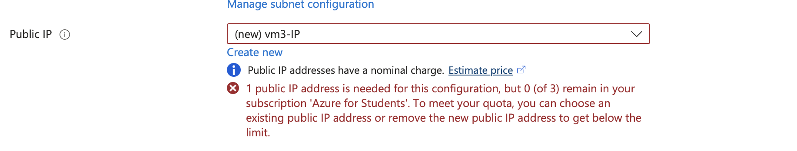
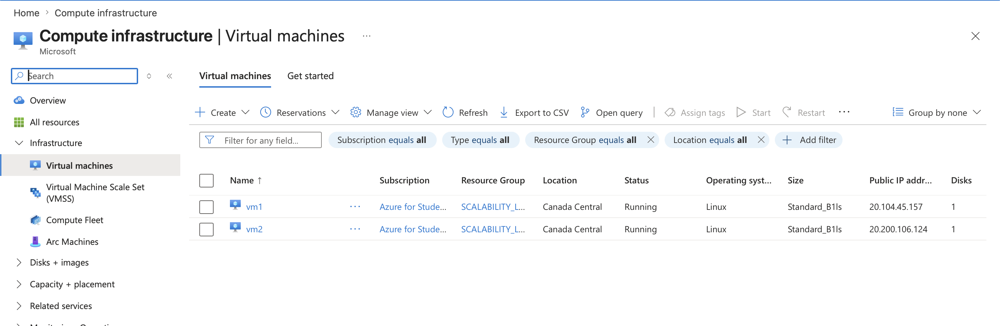
#### Probar el resultado final de nuestra infraestructura

1. Porsupuesto el endpoint de acceso a nuestro sistema será la IP pública del balanceador de carga, primero verifiquemos que los servicios básicos están funcionando, consuma los siguientes recursos:

### Ip del balanceador de carga
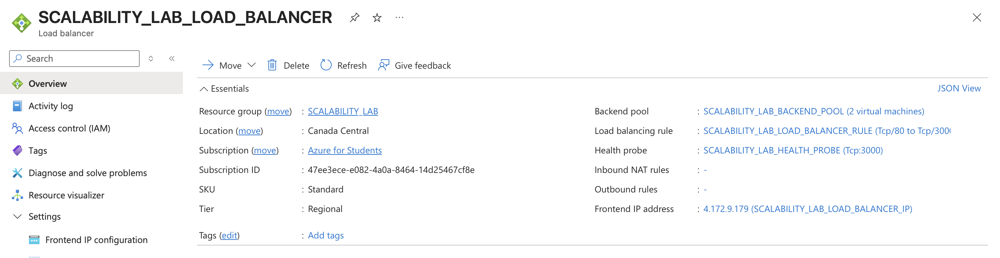


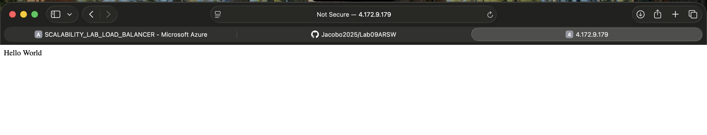
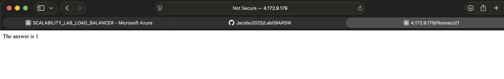

2. Realice las pruebas de carga con `newman` que se realizaron en la parte 1 y haga un informe comparativo donde contraste: tiempos de respuesta, cantidad de peticiones respondidas con éxito, costos de las 2 infraestrucruras, es decir, la que desarrollamos con balanceo de carga horizontal y la que se hizo con una maquina virtual escalada.

    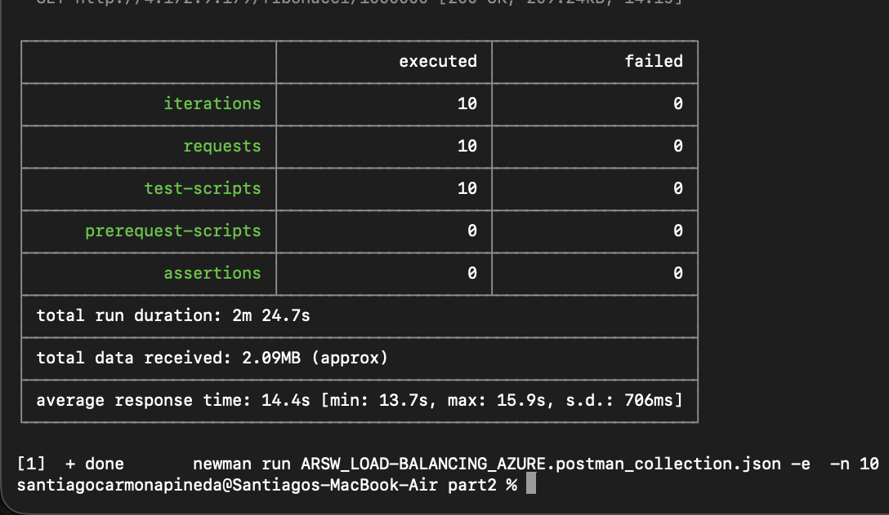

3. Agregue una 4 maquina virtual y realice las pruebas de newman, pero esta vez no lance 2 peticiones en paralelo, sino que incrementelo a 4. Haga un informe donde presente el comportamiento de la CPU de las 4 VM y explique porque la tasa de éxito de las peticiones aumento con este estilo de escalabilidad.

    ```
    newman run ARSW_LOAD-BALANCING_AZURE.postman_collection.json -e [ARSW_LOAD-BALANCING_AZURE].postman_environment.json -n 10 &
    newman run ARSW_LOAD-BALANCING_AZURE.postman_collection.json -e [ARSW_LOAD-BALANCING_AZURE].postman_environment.json -n 10 &
    newman run ARSW_LOAD-BALANCING_AZURE.postman_collection.json -e [ARSW_LOAD-BALANCING_AZURE].postman_environment.json -n 10 &
    newman run ARSW_LOAD-BALANCING_AZURE.postman_collection.json -e [ARSW_LOAD-BALANCING_AZURE].postman_environment.json -n 10
    ```
    Este punto no se puede realizar debido a la limitación de la suscripción de AWS 


**Preguntas**

* ¿Cuáles son los tipos de balanceadores de carga en Azure y en qué se diferencian?, ¿Qué es SKU, qué tipos hay y en qué se diferencian?, ¿Por qué el balanceador de carga necesita una IP pública?
* ¿Cuál es el propósito del *Backend Pool*?
* ¿Cuál es el propósito del *Health Probe*?
* ¿Cuál es el propósito de la *Load Balancing Rule*? ¿Qué tipos de sesión persistente existen, por qué esto es importante y cómo puede afectar la escalabilidad del sistema?.
* ¿Qué es una *Virtual Network*? ¿Qué es una *Subnet*? ¿Para qué sirven los *address space* y *address range*?
* ¿Qué son las *Availability Zone* y por qué seleccionamos 3 diferentes zonas?. ¿Qué significa que una IP sea *zone-redundant*?
* ¿Cuál es el propósito del *Network Security Group*?
* Informe de newman 1 (Punto 2)
* Presente el Diagrama de Despliegue de la solución.


